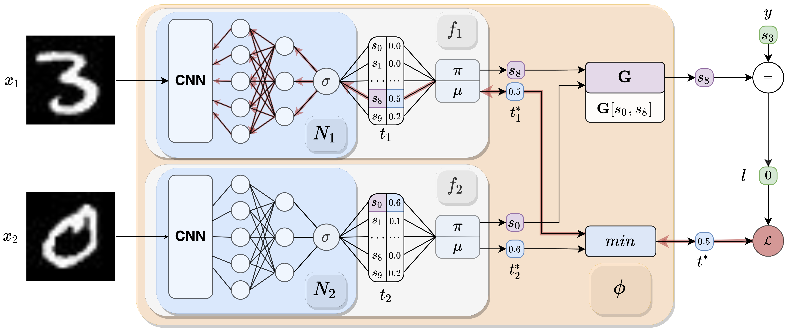

[](https://ijcai-23.org/)
[](https://www.python.org/downloads/release/python-380/)
[](https://arxiv.org/abs/2208.11561)
# Deep symbolic learning: Discovering symbols and rules from perceptions 

This is a PyTorch implementation of the IJCAI 2023 paper, [Deep symbolic learning: Discovering symbols and rules from perceptions](https://arxiv.org/pdf/2208.11561.pdf).

Project Webpage: https://dkm-fbk.github.io/projects/dsl.html


## Setup
Clone the repository and install the requirements:

```
git clone https://github.com/dkm-fbk/DSL.git
cd DSL
conda create -n DSL
conda activate DSL
conda env create --file environment.yml
```

## Usage Examples
```
export PYTHONPATH="$PYTHONPATH:<your path>/DSL"
python examples/mnistAddition/mnistAddition.py"
```
## Citation
>Alessandro Daniele, Tommaso Campari, Sagar Malhotra, Luciano Serafini, 2023. Deep symbolic learning: Discovering symbols and rules from perceptions; in International Joint Conference on Artificial Intelligence (IJCAI). [PDF](https://arxiv.org/pdf/2208.11561.pdf)

## Bibtex
```
  @inproceedings{daniele2023deep,
  title={Deep symbolic learning: Discovering symbols and rules from perceptions},
  author={Daniele, Alessandro and Campari, Tommaso and Malhotra, Sagar and Serafini, Luciano},
  booktitle={International Joint Conference on Artificial Intelligence (IJCAI)},
  year={2023},
}
```